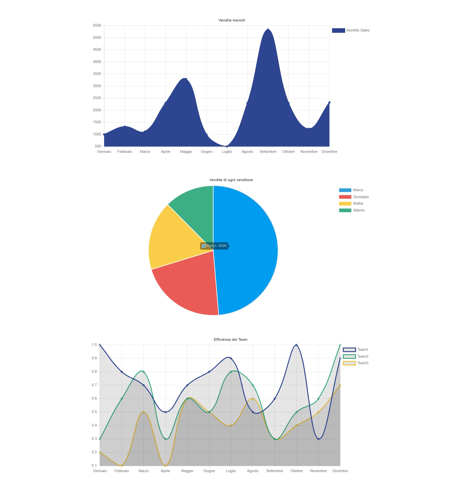

# Php-adv-charts
Dashboard of data taken from an API. Made with ChartJS.  

* The 1° chart is a line chart that shows the sales of the company month by month.
* The 2° chart is a graph chart that shows how much a salesman has contributed (in percentage) to the yearly revenue.
* The 3° chart is a multi-line chart that shows the efficiency of the different teams month by month.  

The data about the chart are saved in PHP and are passed to JS thanks to an ajax request.  
Based on the '?**level**=clevel' passed in the url different charts are shown  

**guest** level 1° chart  
**employee** level 1° and 2° chart  
**clevel** level all the charts.  

HTML, CSS, JavaScript, jQuery, PHP.
***
### Preview-api:

### Preview-clevel:

